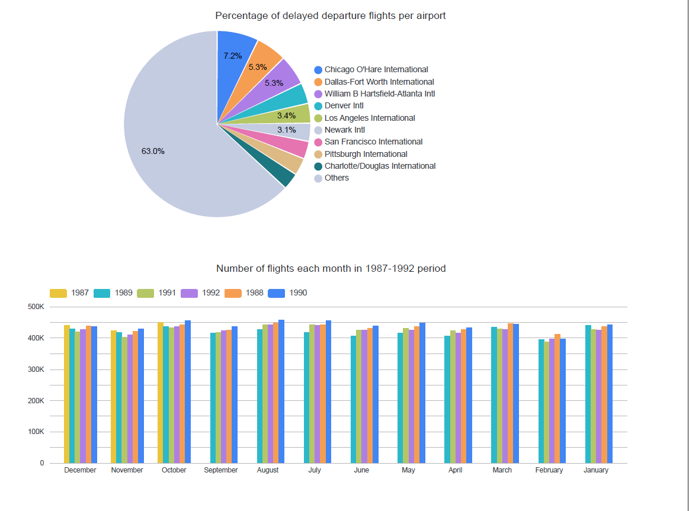
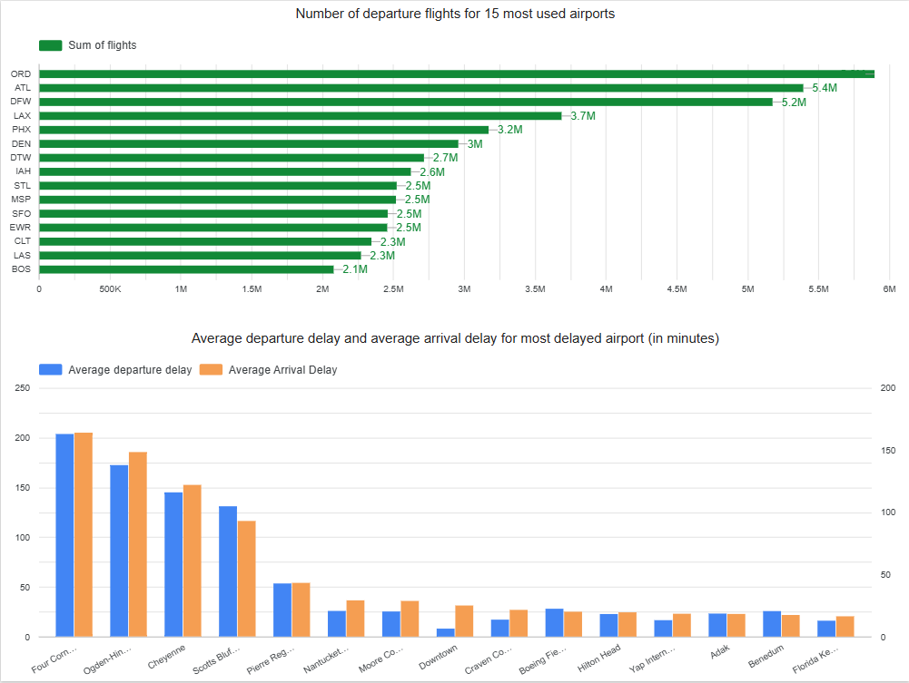

# Data Engineering Zoomcamp Final Project

## Problem Description
Dataset comes from Kaggle [https://www.kaggle.com/datasets/viggo123/data-fight-usa-dataset] and originally from [https://dataverse.harvard.edu/dataset.xhtml?persistentId=doi:10.7910/DVN/HG7NV7].

This project aims to analyze a subset of the airline on-time performance dataset from 1987 to 2007, which contains detailed flight arrival and departure information for all commercial flights within the United States during this period. The data is sourced from the RITA (Research and Innovative Technology Administration) and offers valuable insights into airline operations, delays, cancellations, and more.

In this project, the primary goal is to analyze flight movements within the USA to gain insights into:

 - Which airports experience the most delays and how this varies by time and location.

 - The number of flights departing each year, identifying the trends in terms of traffic.

 - The most frequently used airports for both departures and arrivals, offering an understanding of the central hubs in the U.S. airline network.

The dataset spans 20 years of operational data, covering millions of records, and provides a historical perspective on flight performance, delays, and cancellations. This analysis aims to uncover patterns that can inform future decision-making in airline operations, airport management, and policy-making regarding air travel.

### Key Insights:
Flight operations within the USA

Delays, cancellations, and contributing factors

Airport performance, including traffic volume and delay frequency

Trends in airline industry performance from 1987 to 1992, with a focus on the busiest and most problematic airports


---

## Tools & Technologies Used

For this project, I leveraged the following tools:

- **Kaggle**

- **Google Cloud Platform (GCP)**: Primary cloud provider for hosting services, offering a range of managed solutions.
  
- **Google Cloud Storage (GCS)**: Utilized as the data lake storage within GCP.

- **Google Cloud DataProc**: Running Spark Cluster

- **BigQuery**: Applied as the data warehouse solution for large-scale data analysis.

- **Terraform**: Used as the Infrastructure-as-Code (IaC) tool to automate and provision cloud resources.

- **Airflow**: Orchestration tool for managing and scheduling the end-to-end data pipeline.

- **Spark**: Leveraged for distributed data processing and transformations at scale.

- **DBT (Data Build Tool)**: Implemented for transforming data within the data warehouse, focusing on analytics engineering, modularity, and version control.

- **Looker Studio**: Utilized for creating interactive, dynamic, and customizable data visualizations and reports.

---

## Project Workflow

This combination of tools enabled efficient data management, transformation, and visualization, all within an automated and scalable pipeline. The goal was to analyze flight data, identify trends, and generate meaningful insights that can inform understanding of flight performance during the 1987-1992 period.

---

## Project Setup and Code Reproduction

To run the project code, several steps and configurations are required.

### 1. Google Cloud Platform (GCP)

Make sure the following prerequisites are completed:
- Have an active account on Kaggle

- Have an active account on **Google Cloud Platform (GCP)**.
- Create a **Service Account**.
- Assign the following roles to the service account:
  - `Storage Admin`
  - `BigQuery Admin`
  - `Storage Object Admin`  
  *(Alternatively, you can assign the `Owner` role to grant all necessary permissions.)*
- Enable the following APIs in your GCP project:
  - **Cloud Logging API**  
  - **Cloud Monitoring API**  
  - **Cloud Dataproc Control API**  
  - **Cloud Dataproc API**  
  - **BigQuery API**  
  - **Compute Engine API**  
  - **Cloud Dataplex API**  
  - **Cloud Storage API**
- Download the **JSON key** for your service account. This key is required to authenticate the tools used in this project with GCP.
- Save the JSON key in the following directories:
  - In the `terraform/` directory as: `gcs-key.json`
  - In the `airflow/config/` directory as: `gcs-key.json`
---

### 2. Terraform Setup

To provision the necessary infrastructure on GCP, Terraform must be installed and configured.

#### Step 1: Install Terraform

Download and install Terraform from the official website:  
👉 [https://www.terraform.io/downloads](https://www.terraform.io/downloads)

Follow the installation instructions for your operating system.

---

#### Step 2: Configure `terraform.tfvars`

Navigate to the `terraform/` directory in the project.  
Edit the `terraform.tfvars` file with your specific configuration values, including:

```hcl
project_id       = "<your-gcp-project-id>"
region           = "<your-region>"
credentials_file = "gcs-key.json"
bucket_name      = "<your-bucket-name>"
dataset_id       = "<your-dataset-id>"
cluster_name     = "<your-cluster-name>"
```

Run the following commands from inside the terraform/ directory:
```bash
terraform init
terraform plan
terraform apply
```

-After that remember to set the variables `GCS_BUCKET_NAME` and `GCP_PROJECT_ID` in file `main_spark.py` with the the appropriate names you used in terraform.tfvars.

### 3. Airflow Setup

Before running Airflow, make sure to configure the appropriate environment variables in the `docker-compose.yaml` file. These variables are necessary for authenticating with GCP and enabling Airflow to communicate with Google Cloud services.

#### Required Environment Variables

Inside your `docker-compose.yaml`, set the following:

```yaml
environment:
  - GOOGLE_APPLICATION_CREDENTIALS: '/opt/airflow/config/gcp-key.json'
  - AIRFLOW_CONN_GOOGLE_CLOUD_DEFAULT: 'google-cloud://?key_path=%2Fopt%2Fairflow%2Fconfig%2Fgcp-key.json&project=<your-project-id>'
  - GCP_PROJECT_ID: '<your-project-id>'
  - GCP_GCS_BUCKET: '<your-gcs-bucket-name>'
  - KAGGLE_KEY: '<your-kaggle-api-key>'
  - KAGGLE_USERNAME: '<your-kaggle-account-username>'
```
You can find your API key from Kaggle in Profile settings, then download it, open the file and paste to docker-compose.yaml.

Replace <your-project-id> and <your-gcs-bucket-name> with your actual project and bucket names. Do not use quotation marks in the YAML if your values are plain strings.

Build the Airflow Docker Image
Once the environment variables are set, build the Airflow image using:
    ```bash
    docker-compose build
    ```
Run Airflow
To start the Airflow services, run:
```bash
docker-compose up
```
This will launch the Airflow webserver, scheduler, and any other defined services. You should be able to access the Airflow UI at http://localhost:8080.

### 4. Airflow & DBT Workflow

Once the infrastructure is deployed and raw data is uploaded to GCS, the data pipeline is orchestrated using **Airflow** with multiple DAGs handling each stage of the process.

#### 1. `kaggle_to_gcs` DAG

The first step in the pipeline is to trigger the `kaggle_to_gcs` DAG. This DAG performs the following tasks:

- Reads raw CSV files from the KAGGLE dataset.
- Applies basic cleaning and transformation.
- Writes the cleaned data into the `raw/` folder to GCS bucket.

This staging area serves as the intermediate zone before advanced processing and analytics.

---

#### 2. `kaggle_seeds_to_gcs` DAG

The second step in the pipeline is to trigger the `kaggle_seeds_to_gcs` DAG. This DAG performs the following tasks:

- Reads raw CSV files from the KAGGLE dataset.
- Writes the cleaned data into the `seeds/` folder to GCS bucket.

---

#### 3. `spark_job` DAG

Once the data is staged, the `spark_job` DAG should be triggered. It performs the core transformation using a Spark job running on a Dataproc cluster.

Key steps:

- Uploads the `main_spark.py` script into the `code/` folder in the GCS bucket.
- Submits this script to the **Dataproc cluster**, which executes the following logic:
  - Defines a schema using `StructType` to enforce data types.
  - Renames and casts columns to appropriate types.
  - Joins flight data with the `carriers` reference table for enriched context.
  - Writes the final, transformed table into **BigQuery**.

The resulting BigQuery table is:

- **Partitioned** by the year of the flight (`Year` column).
- **Clustered** by the `Origin` column, which represents the departure airport.

Many queries, such as those filtering by date range (e.g., retrieving flight data for a specific year or a few years), can run much faster since BigQuery can limit its scan to only the relevant partitions (the data for a specific year).

Clustering the data by the Origin (departure airport) helps further optimize the query performance for queries that filter or aggregate by departure airport.

The execution of DBT models is handled automatically by Airflow through the DAG:  
**run_dbt_model.py**

This DAG is triggered **as the final step** in the pipeline after:

1. Data has been staged by the first_stage DAG.
2. Spark processing has been completed by the spark_job DAG.

The DAG runs the DBT CLI inside the container and builds models in the correct order based on their dependencies, ensuring that the final analytics tables in the marts/ layer are ready for consumption.

### 5. Looker Studio

### Dashboard Presentation


Link to dashboard: https://lookerstudio.google.com/reporting/4b22d87f-0b0e-44a9-b03e-caf207fd31d5



Link to dashboard: https://lookerstudio.google.com/reporting/394d813c-9bf6-46c5-a3ad-a5d9fc3b20f1

At the end, I present my dashboard, which shows:

- **Which airports had the most delayed flights.**
- **The number of flights per month from 1987 to 2007.**
- **Which airports had the most departure flights.**
- **Which airports had the highest delays for both departure and arrival flights.**

The dashboard allows for the analysis of data based on various parameters, such as delay times and the total number of flights within a specific period, helping to better understand the patterns of delays and the overall flight traffic during these years.

Once the data has been processed and stored in BigQuery, you can create interactive visualizations using **Looker Studio**.


#### Steps to Create a Dashboard:

1. **Navigate to Looker Studio**:
   Go to [Looker Studio](https://lookerstudio.google.com/) and sign in with your Google account.

2. **Create a New Data Source**:
   - Click on the **Create** button.
   - Select **Data Source** from the dropdown menu.

3. **Connect to BigQuery**:
   - In the data source configuration, choose **BigQuery** as the connection type.
   - Select the appropriate **BigQuery project** and **dataset**.
   - Choose the relevant tables that you want to use for your reports.

4. **Build the Dashboard**:
   - After connecting to your BigQuery tables, use the **Chart** options to create various visualizations (e.g., bar charts, line charts, tables, etc.).
   - Drag the relevant data fields from the right-hand panel into your charts. You may need to add the following additional fields:
     - **Year**: YEAR(flight_date) — to extract the year of the flight from the flight_date field.
     - **Month**: MONTH(flight_date) — to extract the month of the flight from the flight_date field.


